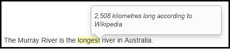

# reviewr
### `R markdown -> html -> add some comments`

<br>

<br>

This site contains a demonstration of html rendered [R markdown](http://rmarkdown.rstudio.com/) (.Rmd) files which you can add comments to in the browser!

Only one line added to the bottom of your .Rmd file is needed to add commenting functionality. You can simply copy and paste the following snippet into your own blank .Rmd file (e.g. foo.Rmd):

```
---
output: html_document
---

## Insert your R markdown content here

## The following line from https://github.com/hypothesis/client adds commenting functionality
<script src="https://hypothes.is/embed.js" async></script>

```

Then render from .Rmd to html with 

```
library(rmarkdown)
rmarkdown::render("foo.Rmd")
```

Try it out with the [minimal example](minimal.html).  

Or check out the slightly bigger [Annotator](annotator_demo.html) and [Hypothesis](hypothesis_demo.html) demo pages.

The Annotator demo page uses [annotator js](http://annotatorjs.org/). It doesn't save annotations but shows one way the contents of an annotation can be extracted using javascript.

The minimal example and the hypothesis demo both use the [hypothesis client](https://github.com/hypothesis/client). An account is required to add comments, which are public by default.  These demo pages also don't yet contain a way to extract annotation contents directly.

Source files available at https://github.com/markdly/reviewr.  

